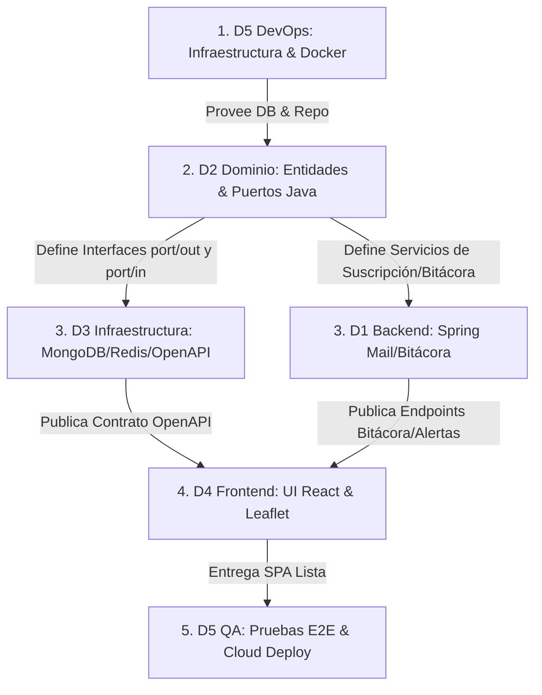

# Secuencia y Orden de Trabajo del Equipo — AguaVigía CTG

> Guía de dependencias y flujo de ejecución para coordinar el trabajo de los 5 desarrolladores sin cuellos de botella ni bloqueos.

---

## 1. Cadena de Dependencias Técnicas (Quién habilita a quién)

En un esquema de Arquitectura Limpia y desarrollo ágil, el trabajo **no es secuencial lineal**, sino en **cascada coordinada por capas**:

---

## 2. El Orden de Trabajo Paso a Paso (Flujo de Sprint)

### **Paso 1: D5 (DevOps) — Prepara el terreno (Paso Inicial)**
* **Por qué va primero**: Nadie puede programar ni probar en local si no existe la estructura de proyectos y los contenedores.
* **Acción**:
  1. Inicializa el repositorio con carpetas `/backend` y `/frontend`.
  2. Levanta el `docker-compose.yml` (MongoDB + Redis + Mailhog).
  3. Carga el GeoJSON de barrios de Cartagena.

### **Paso 2: D2 (Backend Dominio) — Define el corazón (Núcleo del negocio)**
* **Por qué va segundo**: En Arquitectura Limpia, el dominio no depende de nada. Define el lenguaje ubicuo y los contratos.
* **Acción**:
  1. Crea las entidades (`CorteAgua`, `Sector`, `ReporteCiudadano`) y Value Objects (`record`).
  2. Implementa el test de **ArchUnit** (asegura que `domain/` no tenga framework).
  3. Define las interfaces de los puertos (`FuenteDatosPort`, `SectorRepositoryPort`, `NotificacionPort`).

### **Paso 3: D3 y D1 (Backend Infraestructura / Integraciones / Alertas) — Construyen la tubería técnica**
* **Por qué van terceros**: Implementan los puertos definidos por D2 y exponen los servicios hacia el exterior.
* **Acción**:
  * **D3**: Crea los adaptadores de MongoDB (`2dsphere`), Redis (`ZSET`), implementa el Pipeline de Ingesta M9 (IA Anthropic) y publica la especificación **OpenAPI** (`springdoc`).
  * **D1**: Configura Spring Mail contra Mailhog, implementa la Bitácora inmutable append-only y los endpoints de suscripción.

### **Paso 4: D4 (Frontend) — Construye la experiencia visual**
* **Por qué va cuarto**: Necesita el contrato OpenAPI generado por D3 y D1 para autogenerar su cliente HTTP tipado en TypeScript.
* **Acción**:
  1. Corre `npm run api:sync` para obtener los tipos del backend.
  2. Desarrolla los mapas con Leaflet (M1), formulario de reporte en 2 toques (M2), panel del veedor (M5) y la vista de bitácora (M8).
  3. Aplica los tokens visuales de `DESIGN.md` y accesibilidad WCAG AA.

### **Paso 5: D5 (QA / DevOps) — Valida, prueba y despliega (Paso Final)**
* **Por qué va al final**: Asegura que el producto integrado cumpla los requisitos no funcionales (RNF).
* **Acción**:
  1. Corre las pruebas E2E con Playwright.
  2. Realiza la prueba de caos (apaga fuentes externas para verificar resiliencia).
  3. Despliega el backend y frontend en la nube (Render / MongoDB Atlas / Upstash).

---

## 3. Hoja de Ruta Resumida por Sprint

| Sprint | Enfoque Principal del Sprint | D5 (DevOps/QA) | D2 (Dominio) | D3 (Infra/IA) | D1 (Full-Stack/IA Docs) | D4 (Frontend) |
|---|---|---|---|---|---|---|
| **Sprint 0** | Configuración e Infraestructura | Repositorio, Docker Compose, CI/CD | — | — | Plantillas de correo, Prompts IA (Anexos 1–3) | Esqueleto React + Vite, tokens CSS |
| **Sprint 1** | Mapa Base y Dominio Core | Carga GeoJSON barrios | Entidades Java, ArchUnit, Puertos | Adaptador Mongo, API Sectores, OpenAPI | API Suscripción, `@Async` Mail, Prompts (Cap I) | Mapa Leaflet, lista accesible |
| **Sprint 2** | Reporte Ciudadano y Consenso | Testcontainers, JaCoCo | Lógica de Consenso (Strategy Pattern) | Rate Limit Redis, `POST /api/reportes` | Confirmación Doble Opt-in, Prompts (Cap II) | Formulario Reporte 2 toques, SSE |
| **Sprint 3** | Administración y Alertas | Docker Nginx Frontend | Reglas de Corte Oficial (Builder) | CRUD Cortes Veedor, JWT Auth | Backend Bitácora Pública (M8), Prompts (Cap III) | Panel del Veedor, Formulario Alertas |
| **Sprint 4** | Ingesta IA y Cumplimiento ⭐ | Dashboard M7, Chaos Test | `CalcularCumplimientoService` | **Pipeline M9 IA Anthropic**, `citaTextual` | Frontend Timeline Bitácora, Tabular Encuestas | UI Índice Cumplimiento (Barras Comparativas) |
| **Sprint 5** | Calidad, Accesibilidad y PWA | Pruebas E2E Playwright, Cloud Deploy | Cobertura JaCoCo $\ge 70\%$ | Agregaciones Mongo, Reproceso IA | Pruebas integración Mail/Bitácora, Matriz Trazabilidad | Auditoría axe WCAG AA, PWA Offline |
| **Sprint 6** | Entrega Final y Demostración | Carga Dataset Mayo-Julio 2026 | Diagrama de Clases final, SOLID | Diagrama de Componentes | Consolidado Capítulo IV e Informe Final | Manual de Usuario, Ajustes 3G |
